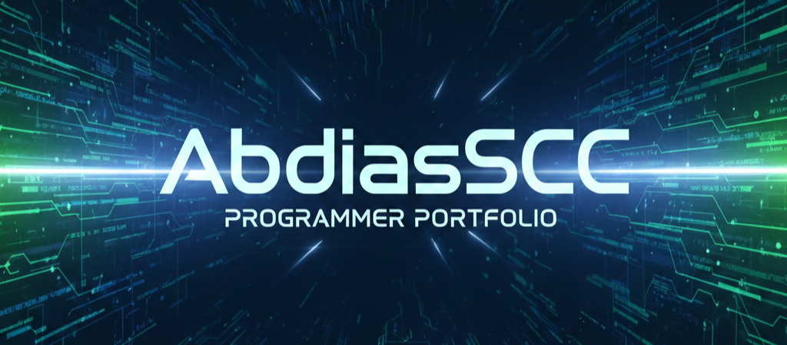

  <h1 align="center">Hola, soy <a>Abdías Campos</a> 👋</h1>
  <h3 align="center">Desarrollador Web / Backend Junior</h3>
  
Laravel · Django · APIs · Bases de Datos

---

## 🧑‍💻 Sobre mí

- 🎓 Técnico Superior Universitario en Informática  
- 🧠 Enfoque principal en **desarrollo backend y sistemas web**
- ⚙️ Experiencia desarrollando **sistemas de gestión y automatización**
- 🔗 Integración de **APIs (correo, WhatsApp, servicios externos)**
- 🏢 Orientado a soluciones reales para empresas

---

## 🛠️ Stack Tecnológico

### Backend
- Laravel (PHP)
- Django (Python)

### Frontend
- HTML5, CSS3, JavaScript
- Tailwind CSS
- Bootstrap
- AdminLTE

### Bases de datos
- MySQL
- PostgreSQL
- phpMyAdmin
- DBeaver

### Herramientas
- Git & GitHub
- Docker
- AJAX
- Integración de herramientas con IA
- Odoo (nivel básico – curso)

### Redes (básico)
- Subneteo y cálculo de redes
- Configuración IP
- Cisco Packet Tracer

---

## 🚀 Proyectos Destacados

<table>
<tr>
<td width="50%">
<h3 align="center">Sistema de Gestión de Recordatorios</h3>

Sistema web para la gestión de servicios y clientes, con automatización de recordatorios.

<strong>Tecnologías:</strong> 
Laravel · AdminLTE · MySQL · AJAX · Tailwind

<ul align="left">
<li>Backend completo con Laravel</li>
<li>Recordatorios automáticos por correo (Gmail SMTP)</li>
<li>Integración de API de WhatsApp</li>
<li>Lógica de servicios y notificaciones programadas</li>
</ul>

</td>

<td width="50%">
<h3 align="center">Sistema de Abastecimiento Alimentario</h3>

Sistema académico para el control del abastecimiento y distribución alimentaria.

<strong>Tecnologías:</strong> 
Laravel · MySQL

<ul align="left">
<li>Rol: Backend Developer / Analista</li>
<li>Modelado de base de datos</li>
<li>Desarrollo de la lógica del sistema</li>
<li>Análisis de requerimientos</li>
</ul>

</td>
</tr>
</table>

 

<table>
<tr>
<td width="50%">
<h3 align="center">Calculadora de Precios</h3>

Herramienta web para el cálculo automático de precios de trabajos en acrílico.

<strong>Tecnologías:</strong> 
HTML · CSS · JavaScript

<ul align="left">
<li>Automatización del proceso de cotización</li>
<li>Lógica de precios en frontend</li>
<li>Solución usada por un negocio real</li>
</ul>

</td>

<td width="50%">
<h3 align="center">Proyecto Todoclick</h3>

Proyecto colaborativo para el desarrollo de una plataforma web.

<strong>Tecnologías:</strong> 
Laravel · MySQL

<ul align="left">
<li>Desarrollo completo del backend</li>
<li>Diseño de arquitectura del sistema</li>
<li>Implementación de la lógica principal</li>
</ul>

</td>
</tr>
</table>

---

## 📌 Qué tipo de problemas sé resolver

- Sistemas de gestión para negocios
- Automatización de procesos
- Integración de APIs
- Backend para aplicaciones web
- Diseño y modelado de bases de datos

---

## 📫 Contacto

- 📧 Email: abdiascampos18@gmail.com

---

⭐ Siempre interesado en aprender, mejorar y formar parte de equipos que desarrollen soluciones reales.
